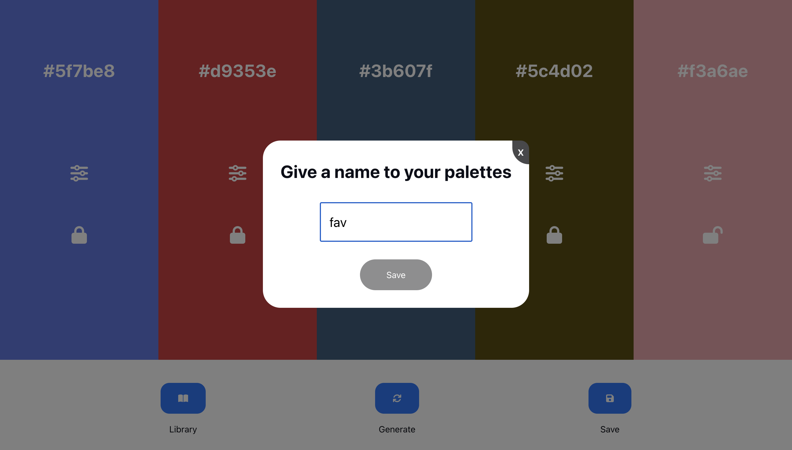
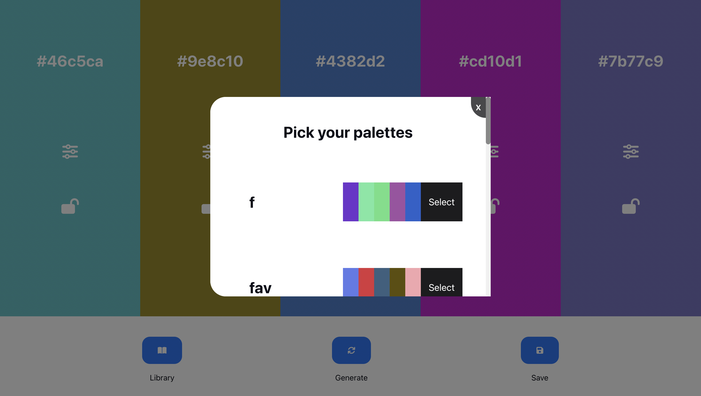
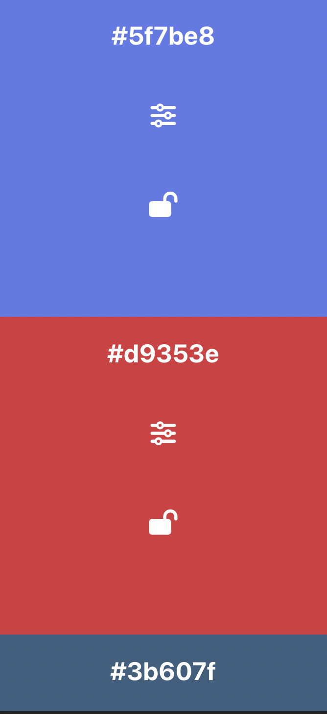
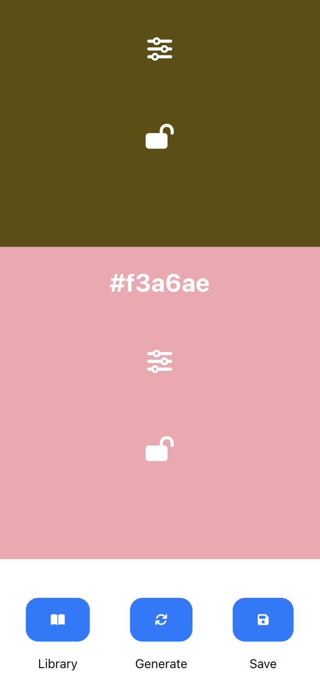

# Colors

    A Frontend Colors Project. This project was meant to brush up on JavaScript and enhance JavaScript skills using the [Chroma.JS](https://gka.github.io/chroma.js/). 

 

    The project allows you to generate random Hex colors and adjust their hue, saturation, and brightness. Once picked you may choose to save them via local storage and regenerate them on your library palettes.  

 

# Main Screen

    

# Save

    

# Library

    

# Mobile

    

    

